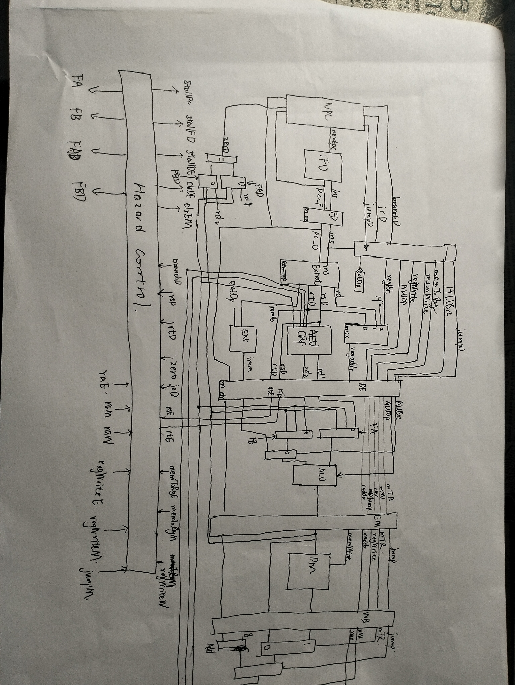

# P4 Verilog CPU 设计文档

23373526 华家璇

## 一、设计草稿

本CPU设计实现了包括add,sub,ori,lui,lw,sw,beq,jal,jr,nop在内的命令，具体实现如下

### （一） 部件设计

#### 1. ALU  

##### 端口定义如下

| 端口名      | 方向 | 描述        |
| :-------:  | ---- | :----:     |
| A[31:0]    | I    | 输入数据A   |
| B[31:0]    | I    | 输入数据B   |
| ALUOp[2:0] | I    | 操作码      |
| result[31:0]| O    | 输出        |
| zero      | O    | 输出        |

##### 功能定义如下

| ALUOp  | O            |
| ------ | :----:       |
| 000    | A&B          |
| 001    | A|B          |
| 010    | A+B          |
| 011    | A-B          |

zero = (A == B) ? 1 : 0


#### 2. GRF

##### 端口定义如下

| 端口名         | 方向 | 描述          |
| :-------:     | ---- | :----:         |
| clk           | I    | 时钟信号       |
| reset         | I    | 异步复位       |
| wenable       | I    | 写使能         |
| waddr[4:0]    | I    | 写地址         |
| raddr2[4:0]   | I    | 读地址1        |
| raddr1[4:0]   | I    | 读地址2        |
| wdata[31:0]   | I    | 写入数据       |
| rdata1[31:0]  | O    | ra1寄存器数据  |
| rdata2[31:0]  | O    | ra2寄存器数据  |
| PC[31:0]      | O    | pc寄存器数据   |

##### 功能定义如下

1. we信号为高电平时，写使能有效，在clk上升沿到来时写入数据WD到waddr对应的寄存器中
2. 始终输出ra1寄存器数据到d1，ra2寄存器数据到d2
3. 异步复位re有效时，将所有寄存器数据清零


#### 3. EXT

##### 端口定义如下

| 端口名         | 方向 | 描述           |
| :-------:     | ---- | :----:        |
| imm16[15:0]   | I    | 输入的立即数    |  
| extOp[1:0]    | I    | 操作码         |
| out32[31:0]   | O    | 扩展后的立即数  |

##### 功能定义如下

| extOp  | out32                |
| ------ | :----:               |
| 00     | 无符号扩展imm16到32位  |
| 01     | 符号扩展imm16到32位    |
| 10     | 将imm16加载到高16位    |


#### 4. DM

##### 端口定义如下

| 端口名         | 方向 | 描述                    |  
| :-------:     | ---- | :----:                 |
| clk           | I    |时钟信号                 |  
| reset         | I    |异步复位信号             |
| memWrite      | I    |写使能                  |
| pc[31:0]      | I    |pc地址                  |
| addr[31:0]    | I    |地址                    |
| writeData[31:0] | I    |写入数据                |
| readData[31:0]  | O    |读取的位于addr地址的数据 |


#### 5. IM

##### 端口定义如下

| 端口名           | 方向 | 描述             |
| :-------------:  | ---- | :--------------: |
| clk             | I    | 输入时钟信号     |
| reset           | I    | 输入复位信号     |
| stall           | I    | 输入停顿信号     |
| next_pc[31:0]   | I    | 输入下一个程序计数器 |
| instr[31:0]     | O    | 输出指令         |
| pc[31:0]        | O    | 输出程序计数器   |


#### 6. NEXTPC

##### 端口定义如下

| 端口名           | 方向 | 描述             |
| :-------------:  | ---- | :--------------: |
| pcF[31:0]       | I    | 输入F阶段程序计数器 |
| pcD[31:0]       | I    | 输入D阶段程序计数器 |
| imm16[15:0]     | I    | 输入16位立即数    |
| imm26[25:0]     | I    | 输入26位立即数    |
| imm32[31:0]     | I    | 输入32位立即数    |
| branch          | I    | 输入分支信号     |
| jump            | I    | 输入跳转信号     |
| jr              | I    | 输入跳转寄存器信号 |
| zero            | I    | 输入零标志信号  |
| next_pc[31:0]   | O    | 输出下一个程序计数器 |


##### 功能定义如下

1.每次时钟上升沿，pc<- pc + 4，取出下一条指令
2.当branch有效，并且zero为1时，pc<- pc + 4 + sign_ext(imm16<<2)
3.当jump有效，pc<- {pc[31:28] , instrIndex,2'b0} 
4.当jr有效，pc<- imm32

#### 7. Controller

##### 端口定义如下

| 端口名             | 方向 | 描述                    |  
| :-------:         | ---- | :----:                 |
|instr[31:0]        | I    |指令                    |
|regDst[2:0]        | O    |寄存器选择               |
|aluSrc             | O    |ALU数据来源             |
|memToReg           | O    |存储器数据来源           |
|memWrite           | O    |存储器写使能             |
|branch             | O    |R型分支控制               |
|jump               | O    |J型分支控制               |
|jr                 | O    |Jr型分支控制             |
|regWrite           | O    |寄存器写使能             |
|aluOp[2:0]         | O    |ALU操作码                |
|extOp[2:0]         | O    |扩展操作码               |

##### 功能定义如下

1.  RegDst: 选择写入的寄存器， 0->rt, 1->rd, 2->ra
2.  ALUSrc: 选择ALU数据来源， 0->rt, 1->ext
3.  MemToReg: 选择GRF数据来源， 0->ALU, 1->DM
4.  MemWrite: 选择是否写入存储器
5.  Branch: 是否存在条件分支
6.  Jump: 是否存在无条件跳转
7.  RegWrite: 选择是否写入寄存器
8.  ALUOp: 选择ALU操作码 
9.  extOp: 选择扩展操作码
9.  jr: 是否发生寄存器跳转

##### 当前指令真值表如下

| instruction | RegDst | ALUSrc | MemToReg | MemWrite | Branch  | Jump    | RegWrite | ALUOp | extOp  |jr  |
| :----------:| :-----:| :-----:| :-------:| :-------:| :------:| :------:|:-------: |:-----:|:-----: | :-:|
| add         | 001    | 0      | 0        | 0        | 0       | 0       | 1        | 010   | 000    | 0  |
| sub         | 001    | 0      | 0        | 0        | 0       | 0       | 1        | 011   | 000    | 0  |
| ori         | 000    | 1      | 0        | 0        | 0       | 0       | 1        | 001   | 000    | 0  |
| beq         | 000    | 0      | 0        | 0        | 1       | 0       | 0        | 100   | 000    | 0  |
| lui         | 000    | 1      | 0        | 0        | 0       | 0       | 1        | 010   | 010    | 0  |
| lw          | 000    | 1      | 1        | 0        | 0       | 0       | 1        | 010   | 001    | 0  |
| sw          | 000    | 1      | 0        | 1        | 0       | 0       | 0        | 010   | 001    | 0  |
| jal         | 010    | 0      | 0        | 0        | 0       | 1       | 1        | 000   | 001    | 0  |
| jr          | 000    | 0      | 0        | 0        | 0       | 0       | 0        | 010   | 001    | 1  |
| jalr        | 001    | 0      | 0        | 0        | 0       | 0       | 1        | 010   | 001    | 1  |
| j           | 000    | 0      | 0        | 0        | 0       | 1       | 0        | 000   | 001    | 0  |

#### 8. insExtract

提取指令中的各部分

##### 端口定义如下

| 端口名             | 方向 | 描述                   |  
| :-------:         | ---- | :----:                |
|instr[31:0]        | I    |指令                   |
|imm16[15:0]        | O    |指令中的立即数          |
|rs[4:0]            | O    |指令中rs地址            |
|rt[4:0]            | O    |指令中rt地址            |
|rd[4:0]            | O    |指令中rd地址            |
|imm26[25:0]        | O    |J型指令中的地址          |

#### 9. hazardcontrol

##### 端口定义如下

| 端口名        | 方向 | 描述            |
| :-----------: | ---- | :-------------: |
| rsD[4:0]      | I    | 输入寄存器rsD   |
| rtD[4:0]      | I    | 输入寄存器rtD   |
| rsE[4:0]      | I    | 输入寄存器rsE   |
| rtE[4:0]      | I    | 输入寄存器rtE   |
| raE[4:0]      | I    | 输入寄存器raE   |
| raM[4:0]      | I    | 输入寄存器raM   |
| raW[4:0]      | I    | 输入寄存器raW   |
| branchD       | I    | 输入分支信号    |
| jrD           | I    | 输入跳转信号    |
| zero          | I    | 输入零标志信号 |
| jumpM         | I    | 输入跳转信号M   |
| regWriteE     | I    | 输入写回信号E  |
| regWriteM     | I    | 输入写回信号M  |
| regWriteW     | I    | 输入写回信号W  |
| memToRegE     | I    | 输入写回数据选择信号E |
| memToRegM     | I    | 输入写回数据选择信号M |
| FowardA[1:0]  | O    | 输出FowardA信号 |
| FowardB[1:0]  | O    | 输出FowardB信号 |
| FowardAD[1:0] | O    | 输出FowardAD信号 |
| FowardBD[1:0] | O    | 输出FowardBD信号 |
| stallPC       | O    | 输出PC停顿信号  |
| stallF2D      | O    | 输出F2D停顿信号 |
| stallD2E      | O    | 输出D2E停顿信号 |
| ClrE2M        | O    | 输出E2M清除信号 |
| ClrD2E        | O    | 输出D2E清除信号 |

冲突共以下几种情况

1. E级 rs rt 需要用到M、W级的结果，通过FowardA、FowardB控制
   2'b00 : 无需写回
   2'b01 : 写回W级
   2'b10 : 写回M级
   2'b11 : 0寄存器

2. E级需要用到M级jal 结果，停顿一周期再转发

3. load-use 冲突 ，D级rs 或 rt 需要用到E级load结果，停顿一周期再转发

4. D级 beq 比较rs rt 需要用到后续的结果，通过FowardAD、FowardBD控制
   2'b00 : 无需写回
   2'b01 : 写回W级
   2'b10 : 写回M级
    2'b11 : 0寄存器
   若 需要用到 E级结果， 停顿一周期， 再写回
   若 需要用到 M级读内存结果， 停顿一周期， 再写回
   若 需要用到 E读内存级结果， 停顿两周期， 再写回

5. D级jr
    2'b00 : 无需写回
    2'b01 : 写回W级
    2'b10 : 写回M级
    2'b11 : 0寄存器

    若 需要用到 E级结果， 停顿一周期， 再写回
    若 需要用到 M级读内存结果， 停顿一周期， 再写回
    若 需要用到 E读内存级结果， 停顿两周期， 再写回

#### 10. FDreg

F/D 级寄存器

##### 端口定义如下

| 端口名        | 方向 | 描述             |
| :-----------: | ---- | :--------------: |
| clk           | I    | 输入时钟信号     |
| reset         | I    | 输入复位信号     |
| stall         | I    | 输入停顿信号     |
| instr[31:0]   | I    | 输入指令         |
| pc[31:0]      | I    | 输入程序计数器   |
| instr_out[31:0] | O  | 输出指令         |
| pc_out[31:0]  | O    | 输出程序计数器   |

#### 11. DEreg

D/E 级寄存器

##### 端口定义如下

| 端口名           | 方向 | 描述             |
| :-------------:  | ---- | :--------------: |
| clk             | I    | 输入时钟信号     |
| reset           | I    | 输入复位信号     |
| pc[31:0]        | I    | 输入程序计数器   |
| regaddr[4:0]    | I    | 输入寄存器地址   |
| rdata1[31:0]    | I    | 输入寄存器1数据  |
| rdata2[31:0]    | I    | 输入寄存器2数据  |
| imm32[31:0]     | I    | 输入立即数       |
| aluOp[2:0]      | I    | 输入ALU操作码    |
| rs[4:0]         | I    | 输入寄存器rs     |
| rt[4:0]         | I    | 输入寄存器rt     |
| aluSrc          | I    | 输入ALU源选择信号 |
| memToReg        | I    | 输入写回数据选择信号 |
| regWrite        | I    | 输入写回使能信号 |
| memWrite        | I    | 输入内存写使能信号 |
| branch          | I    | 输入分支信号     |
| jump            | I    | 输入跳转信号     |
| stall           | I    | 输入停顿信号     |
| pc_out[31:0]    | O    | 输出程序计数器   |
| regaddr_out[4:0]| O    | 输出寄存器地址   |
| rdata1_out[31:0]| O    | 输出寄存器1数据  |
| rdata2_out[31:0]| O    | 输出寄存器2数据  |
| imm32_out[31:0] | O    | 输出立即数       |
| aluOp_out[2:0]  | O    | 输出ALU操作码    |
| rs_out[4:0]     | O    | 输出寄存器rs     |
| rt_out[4:0]     | O    | 输出寄存器rt     |
| aluSrc_out      | O    | 输出ALU源选择信号 |
| memToReg_out    | O    | 输出写回数据选择信号 |
| regWrite_out    | O    | 输出写回使能信号 |
| memWrite_out    | O    | 输出内存写使能信号 |
| branch_out      | O    | 输出分支信号     |
| jump_out        | O    | 输出跳转信号     |


#### 12. EMreg

E/M 级寄存器

##### 端口定义如下

| 端口名           | 方向 | 描述             |
| :-------------:  | ---- | :--------------: |
| clk             | I    | 输入时钟信号     |
| reset           | I    | 输入复位信号     |
| pc[31:0]        | I    | 输入程序计数器   |
| regaddr[4:0]    | I    | 输入寄存器地址   |
| alures[31:0]    | I    | 输入ALU运算结果  |
| memToReg        | I    | 输入写回数据选择信号 |
| regWrite        | I    | 输入写回使能信号 |
| rdata2[31:0]    | I    | 输入寄存器2数据  |
| memWrite        | I    | 输入内存写使能信号 |
| branch          | I    | 输入分支信号     |
| jump            | I    | 输入跳转信号     |
| pc_out[31:0]    | O    | 输出程序计数器   |
| regaddr_out[4:0]| O    | 输出寄存器地址   |
| alures_out[31:0]| O    | 输出ALU运算结果  |
| memToReg_out    | O    | 输出写回数据选择信号 |
| regWrite_out    | O    | 输出写回使能信号 |
| rdata2_out[31:0]| O    | 输出寄存器2数据  |
| memWrite_out    | O    | 输出内存写使能信号 |
| branch_out      | O    | 输出分支信号     |
| jump_out        | O    | 输出跳转信号     |

#### 13. WBreg

M/W 级寄存器

##### 端口定义如下

| 端口名           | 方向 | 描述             |
| :-------------:  | ---- | :--------------: |
| clk             | I    | 输入时钟信号     |
| reset           | I    | 输入复位信号     |
| pc[31:0]        | I    | 输入程序计数器   |
| regaddr[4:0]    | I    | 输入寄存器地址   |
| alures[31:0]    | I    | 输入ALU运算结果  |
| memres[31:0]    | I    | 输入内存读取结果 |
| memToReg        | I    | 输入写回数据选择信号 |
| regWrite        | I    | 输入写回使能信号 |
| jump            | I    | 输入跳转信号     |
| pc_out[31:0]    | O    | 输出程序计数器   |
| regaddr_out[4:0]| O    | 输出寄存器地址   |
| alures_out[31:0]| O    | 输出ALU运算结果  |
| memres_out[31:0]| O    | 输出内存读取结果 |
| memToReg_out    | O    | 输出写回数据选择信号 |
| regWrite_out    | O    | 输出写回使能信号 |
| jump_out        | O    | 输出跳转信号     |

### （二） CPU主体设计

#### 设计草案

如图



## 二、测试方案

通过适当构造mips汇编代码对hazardcontrol中的各类冒险以及运算结果正确性进行测试，以mars输出作为正确结果进行比较

1. 测试M级转发
```s
    ori $1,$1,1
    ori $2,$2,10
    ori $3,$2,11  # M级转发
```

2. 测试W级转发
```s
    ori $1,$1,1
    ori $2,$2,10
    ori $3,$1,11  # W级转发
```

3. 测试内部转发
```s
    ori $1,$1,1
    ori $2,$2,10
    ori $3,$3,1145
    ori $1,$1,11  # grf 内部转发
```

4. 测试beq M级转发
```s
    L1:
    ori $1,$1,1
    ori $2,$2,10
    ori $3,$3,11
    beq $2,$0,L1 # beq M级转发
    ori $3,$3,1145
```

5. 测试beq W级转发
```s
    L1:
    ori $1,$1,1
    ori $2,$2,10
    ori $3,$3,11
    beq $1,$0,L1 # beq W级转发
    ori $3,$3,1145
```

6. 测试beq E级停顿
```s
    L1:
    ori $1,$1,1
    ori $2,$2,11
    ori $3,$3,11
    beq $3,$2,L1 # beq E级停顿
    ori $3,$3,1145
```

7. 测试beq E级load停顿
```s
    L1:
    ori $1,$1,1
    sw $1,0($0)
    ori $2,$2,11
    ori $3,$3,11
    lw $2,0($0)
    beq $2,$1,L1 # beq E级load停顿
    ori $3,$3,1145
```

8. 测试beq M级load停顿
```s
    L1:
    ori $1,$1,1
    sw $1,0($0)
    ori $2,$2,11
    lw $2,0($0)
    ori $3,$3,11
    beq $2,$1,L1 # beq E级load停顿
    ori $3,$3,1145
```

9. 测试jr E级停顿
```s
    ori $1,$1,0x3000
    jr $1 # jr E级停顿
    ori $2,$2,0x1145
```

10. 测试jr E级load停顿
```s
    ori $1,$1,0x3000
    sw $1,0($0)
    lw $2,0($0)
    jr $2 # jr E级停顿
    ori $3,$3,0x1145
```

11. 测试jr M级load停顿
```s
    ori $1,$1,0x3000
    sw $1,0($0)
    lw $2,0($0)
    ori $4,$4,0x1919
    jr $2 # jr E级停顿
    ori $3,$3,0x1145
```

12. 测试E级对于M级jal的冒险
```s
    L1:
    ori $1,$1,0x3000
    ori $2,$2,0x1919
    jal L1 
    ori $31,$31,0x1145 # 需要jal结果
```

## 三、思考题

1. 如将beq指令提前到D级判断，此时若需要E级lw结果，需要停顿两周期获取结果，效率并没有显著提高

```mips
...
lw $2,0($0)
beq $1,$2,L1
...
```

2. 延迟槽中指令相对于跳转指令为PC+4，但是延迟槽中指令一定会被执行，是属于jal之前的内容，故应将延迟槽的下一条指令的地址写到ra中，即PC+8

3. 功能部件输出不稳定，易产生错误

4. GRF写入地址与读取地址相同时，由于下一周期才会将数据写入，此时读取地址的数据还未写入，故可能会读取到错误的数据。实现方法如下

```verilog
assign rdata1 = (waddr==raddr1&&waddr!=0&&wenable)?wdata: regfile[raddr1];
assign rdata2 = (waddr==raddr2&&waddr!=0&&wenable)?wdata: regfile[raddr2];
```

5. 供给者 ： M级alu输出 W级选择器输出
    需求者： E级alu输入 （rs，rt） D级 beq 比较rs rt 
    需要有从两供给者到两需求者的数据通路

6. R型计算指令 可能扩展ALU
    I型计算指令，可能扩展 ALU，EXT
    I型跳转，可能扩展ALU，EXT
    R型跳转， 可能扩展一些选择器，EXT,ALU
    J型跳转 可能扩展一些选择器，EXT,ALU

7. 我的译码器是取控制信号每种取值所对应的指令。示例如下,优势是对控制信号修改更为简单，劣势是不能直观看出指令的输出是什么

```verilog

wire add = (opcode == 6'b000000 && funct == 6'b100000);
...
memWrite = add | sub | ...;
...
```
